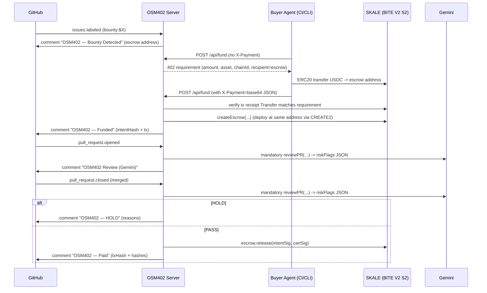

# OSM402 — DoraHacks Submission Details

**Fund with x402. Merge with Proof. Pay by Mandate.**

OSM402 is a GitHub-native bounty system where an agent can fund issues via x402 (HTTP `402` → pay → retry) and settle payouts on merge via an onchain escrow, with a deterministic policy engine and a mandatory Gemini review that can trigger `HOLD` but never decides payout amounts.

## TL;DR

- **Real workflow:** issue labeled → agent funds via x402 → PR reviewed (Gemini risk flags) → merge triggers deterministic payout → onchain receipt + GitHub audit comments
- **Deterministic payouts:** `.osm402.yml` computes amounts; AI cannot set payout amounts
- **Safety:** spend caps, required checks, `HOLD` rules for sensitive paths; Gemini failures fail-closed into `HOLD`

## System Architecture

OSM402 is deliberately built around a **real payment + settlement loop** that is still auditable in GitHub.

```text
GitHub Repo (issues/PRs/comments)
  ├─ issues.labeled ("bounty:$X") ───────────────┐
  ├─ pull_request.opened/synchronize/closed ─────┤  (webhooks + REST reads)
  └─ issue_comment.created (address claim) ──────┘
                          │
                          v
                    OSM402 Server (Express)
  - /api/webhooks/github  (HMAC verify + delivery dedupe)
  - /api/fund             (x402 402 → pay → retry; escrow funding)
  - /api/payout/execute   (manual/verification endpoint)
  - SQLite stores         (issues, prs, payouts, webhook deliveries)
  - Gemini reviewer       (mandatory; risk flags only)
                          │
         ┌────────────────┴────────────────┐
         v                                 v
SKALE BITE V2 Sandbox 2 (EVM)          Gemini API (HTTP)
  - USDC (ERC20)                        - structured JSON output
  - IssueEscrowFactory (CREATE2)        - riskFlags -> HOLD signal
  - IssueEscrow (per issue escrow)
```

**Key building blocks (where to look):**

- GitHub webhook ingestion + dedupe: `apps/server/src/routes/webhooks.ts`, `apps/server/src/store/events.ts`
- x402 challenge + onchain verification: `apps/server/src/middleware/x402.ts`
- Funding endpoint (escrow pre-address + 402 flow): `apps/server/src/routes/fund.ts`
- Deterministic policy + HOLD: `packages/policy/src/*`, `.osm402.yml`
- Mandate model (AP2-inspired EIP-712 Intent/Cart): `packages/mandates/src/*`, `apps/server/src/services/releaseConfig.ts`, `contracts/src/IssueEscrow.sol`
- Settlement on merge + GitHub receipts: `apps/server/src/handlers/mergeDetected.ts`, `apps/server/src/services/comments.ts`

## Interfaces (APIs, Webhooks, Onchain)

### GitHub Webhook Endpoint

- `POST /api/webhooks/github`
  - verifies `X-Hub-Signature-256` using `GITHUB_WEBHOOK_SECRET`
  - deduplicates deliveries via `X-GitHub-Delivery`
  - routes:
    - `issues.labeled` → creates a PENDING issue + posts `OSM402 — Bounty Detected`
    - `pull_request.opened` → runs **mandatory** Gemini review + posts `OSM402 Review (Gemini)`
    - `pull_request.closed` (merged) → computes payout, evaluates HOLD, and settles

### Internal Demo APIs (Shared Secret)

All routes below require `X-OSM402-Secret` matching `OSM402_ACTION_SHARED_SECRET`.

- `POST /api/fund` (x402)
  - first call without `X-Payment` returns `402` with payment requirement
  - retry with `X-Payment` triggers onchain verification and escrow funding
- `GET /api/fund/:owner/:repo/:issueNumber` returns issue funding status
- `POST /api/payout/execute` triggers onchain settlement for an existing payout record
  - returns `409` when the payout is `HOLD`

### Onchain Contracts

- `IssueEscrowFactory` (CREATE2):
  - deterministic escrow address lets x402 transfer fund the escrow **before** deployment
  - file: `contracts/src/IssueEscrowFactory.sol`
- `IssueEscrow` (per issue):
  - verifies Intent + Cart EIP-712 signatures and releases funds once
  - file: `contracts/src/IssueEscrow.sol`

## Tracks

- Overall Track: Best Agentic App / Agent
- Best Integration of AP2

## GitHub + Onchain Addresses

GitHub:

- Repo: `https://github.com/IHB1-Foundation/OSM402-monorepo`
- Demo repo (seeded baseline + 2 PR branches): `https://github.com/0xYatha/OSM402-demo-repo`

Onchain (BITE V2 Sandbox 2, chainId `103698795`):

- `IssueEscrowFactory`: `0xc963e7fa131A82F520331f0712C8DA46Bc0E92b9`
- `USDC`: `0xc4083B1E81ceb461Ccef3FDa8A9F24F0d764B6D8` (decimals `6`)

## Track Fit and Requirement Mapping

### Overall Track: Best Agentic App / Agent

This is our primary track. We demonstrate an end-to-end commerce workflow with real payment and settlement.

| Track requirement | How OSM402 implements it | Where in the repo | Evidence to show |
|---|---|---|---|
| Real workflow: discover → decide → pay/settle → outcome | GitHub issue labeled becomes a bounty candidate; agent funds via x402; merge triggers deterministic payout via escrow; comments + tx hashes as receipts | Discover/decide: `packages/policy/`, `docs/PROJECT.md` • Pay: `apps/server/src/routes/fund.ts`, `apps/server/src/middleware/x402.ts`, `apps/server/src/scripts/x402Fund.ts` • Settle: `apps/server/src/handlers/mergeDetected.ts`, `apps/server/src/routes/payout.ts`, `contracts/src/IssueEscrow.sol` | Demo sequence below + `pnpm evidence:collect` output + GitHub comments `OSM402 — Funded/Paid/HOLD` |
| Meaningful agents/protocols | x402 (HTTP `402` → pay → retry) + EIP-712 mandates for authorization + onchain escrow settlement | `apps/server/src/middleware/x402.ts`, `packages/mandates/`, `contracts/` | Show a real 402 challenge + onchain USDC transfer + retry success |
| Reliability (deterministic flow) | `.osm402.yml` policy drives deterministic tiers + HOLD rules; payout is computed from policy, not AI; errors fail safely into `HOLD` | `packages/policy/`, `.osm402.yml`, `apps/server/src/handlers/mergeDetected.ts` | PASS and HOLD merge cases; repeat payout attempt should be blocked/idempotent |
| Trust + safety guardrails | Spend caps (`bounty:$X`), required checks, sensitive-path HOLD rules, webhook HMAC verification, shared secret for internal endpoints | `.osm402.yml`, `apps/server/src/routes/fund.ts`, `apps/server/src/routes/payout.ts`, `apps/server/src/routes/webhooks.ts` | HOLD scenario for `.github/workflows/**` + `/api/payout/execute` returns `409` |
| Receipts / audit trail | Every step emits a human-readable GitHub comment with hashes + tx links; evidence bundle script captures API responses + AP2 failure logs | `apps/server/src/services/comments.ts`, `scripts/evidence-pack.sh` | `artifacts/evidence-*/SUMMARY.md` + screenshots of GitHub comments |

### Best Integration of AP2

We implement an AP2-inspired authorization pattern: **Intent (maintainer) → Cart (agent) → settlement (escrow release) → receipt**.

| Track requirement | How OSM402 implements it | Where in the repo | Evidence to show |
|---|---|---|---|
| Clean intent → authorization → settlement | Maintainer signs an **Intent** (cap/expiry/policy) and agent signs a **Cart** (intentHash/mergeSha/pr/recipient/amount). Escrow verifies both and executes `release(...)`. | `packages/mandates/`, `apps/server/src/services/releaseConfig.ts`, `contracts/src/IssueEscrow.sol` | Paid merge shows `intentHash` + `cartHash` + onchain `txHash` in GitHub comment |
| Auditable receipt/record | GitHub comments include `txHash`, `cartHash`, `intentHash`, merge SHA; onchain tx is linkable in the explorer | `apps/server/src/services/comments.ts`, `apps/server/src/config/chains.ts` | Screenshot of `OSM402 — Paid` comment + explorer link |
| Failure mode evidence | Foundry tests cover invalid signer, replay/double-pay, and mismatch cases reverting | `scripts/ap2-failure-mode.sh`, `contracts/test/IssueEscrow.t.sol` | `pnpm demo:ap2-failure` output + `pnpm evidence:collect` bundle |
| Clear authorization boundaries | Authorization is separated from execution: signatures are created by specific roles; settlement happens in escrow with replay protection | `apps/server/src/services/releaseConfig.ts`, `contracts/src/IssueEscrow.sol` | Show signers + failure-mode tests |

### Not Targeted (This Submission)

- **Agentic Tool Usage on x402 (CDP Wallets)**: we demonstrate the real x402 `402` → pay → retry flow, but we do **not** integrate CDP Wallets custody/signing in this repo.
- **Best Trading / DeFi Agent**: no trading, routing, or DeFi actions are implemented.
- **Encrypted Agents (BITE v2 threshold encryption)**: we deploy and run on the BITE V2 Sandbox 2 chain, but we do **not** use BITE v2 threshold encryption / conditional decryption flows in this project.

## What Judges Should See (2–3 min)

1. **Health check:** `ai.configured=true` (Gemini is required).
2. **Funding x402 flow:** `POST /api/fund` (with `X-OSM402-Secret`) → server returns `402` → agent pays onchain USDC transfer → retry with `X-Payment` → funded.
3. **PASS merge payout:** merge PR touching only safe paths → `OSM402 — Paid` comment + tx hash.
4. **HOLD merge:** merge PR touching `.github/workflows/**` → `OSM402 — HOLD` comment + `/api/payout/execute` returns `409`.
5. **AP2 failure mode:** run contract tests proving invalid signer / replay / mismatch reverts.
6. **Evidence bundle:** one folder with JSON/logs to screenshot.

## End-to-End Workflow

### Sequence (Real GitHub + Real Onchain)

This is the exact flow we demo (real webhooks + real USDC transfer + real escrow release).



### 1) Discover

- Issues become candidates when labeled like `bounty:$0.1` (demo).
- Buyer agent finds open bounty issues and prepares funding.

### 2) Decide

- Deterministic policy from `.osm402.yml` defines payout tiers and HOLD rules.
- Mandatory Gemini review produces structured `riskFlags` that can also trigger `HOLD`.
- AI never chooses payout amount.

### 3) Pay / Settle

- Funding endpoint returns an x402 challenge (real flow):
  - HTTP `402` with `requirement` (amount, asset, chainId, recipient=predicted escrow address)
  - agent pays (onchain ERC20 `Transfer`) and retries with:
    - `X-Payment: base64(JSON({ txHash, chainId, asset, amount, payer }))`
- Payout settlement happens on merge:
  - maintainer Intent + agent Cart EIP-712 mandates
  - escrow `release(...)` executes with replay protection

### 4) Outcome (Receipts)

- GitHub comments include evidence fields (e.g. tx hash, intent/cart hashes).
- `scripts/evidence-pack.sh` collects a submission bundle under `artifacts/`.

## Core Technical Details

### x402 (HTTP 402 → Pay → Retry)

**First call (no payment)**

- `POST /api/fund` returns HTTP `402` and an x402 requirement payload.

Example (shape):

```json
{
  "status": 402,
  "message": "Payment Required",
  "x402": {
    "version": "1",
    "requirement": {
      "amount": "100000",
      "asset": "0xc4083B1E81ceb461Ccef3FDa8A9F24F0d764B6D8",
      "chainId": 103698795,
      "recipient": "0x<escrow_predicted_address>",
      "description": "Fund bounty for owner/repo#1"
    },
    "instructions": {
      "type": "x402",
      "header": "X-Payment",
      "format": "base64 JSON: { txHash, chainId, asset, amount, payer }"
    }
  }
}
```

**Retry (with payment proof)**

- Client pays onchain (USDC `transfer(to=recipient, amount)`).
- Client retries with `X-Payment` header:

```json
{"txHash":"0x...","chainId":103698795,"asset":"0xc408...","amount":"100000","payer":"0x..."}
```

**Server verification rule (real-chain mode)**

- fetch tx receipt from `activeChain.rpcUrl`
- decode ERC20 `Transfer(from,to,value)` logs
- require:
  - `log.address == requirement.asset`
  - `to == requirement.recipient`
  - `sum(value) >= requirement.amount`

Implementation: `apps/server/src/middleware/x402.ts`

### Escrow Funding via CREATE2 (Why it works)

We intentionally send the x402-funded transfer to the **predicted** escrow address. The server then deploys the escrow at the same address via `IssueEscrowFactory` (CREATE2).

- `predictEscrowAddress(...)`: `apps/server/src/services/escrow.ts`
- `IssueEscrowFactory.computeSalt(...)`: `contracts/src/IssueEscrowFactory.sol`

This makes the payment requirement deterministic and auditable: the recipient is not a random address, it is the escrow address for `(repoKeyHash, issueNumber, policyHash)`.

### AP2-Inspired Mandates (EIP-712 Intent + Cart)

We model authorization as two signatures:

1. **Intent (maintainer)**: authorizes a bounded spending policy for an issue
2. **Cart (agent)**: authorizes a specific payment for a specific merge outcome

Typed data definitions live in `packages/mandates/src/types.ts`:

- Intent fields: `chainId, repoKeyHash, issueNumber, asset, cap, expiry, policyHash, nonce`
- Cart fields: `intentHash, mergeSha, prNumber, recipient, amount, nonce`

Onchain enforcement happens in `IssueEscrow.release(...)`:

- rejects invalid signer / replay / mismatch (chain/repo/issue/policy/cap/expiry)
- enforces one-time release (`paid` + nonce maps)
- emits `Released(amount, recipient, cartHash, intentHash, mergeSha)` for auditability

### Deterministic Policy + HOLD (+ Mandatory Gemini Risk Flags)

- `.osm402.yml` is loaded from the repo at `mergeSha` (fallback policy is used if missing/invalid)
  - policy parsing + payout calc: `packages/policy/src/parser.ts`, `packages/policy/src/payout.ts`
  - HOLD rules: `packages/policy/src/hold.ts`
- Gemini is **mandatory**:
  - it produces structured `riskFlags` only (never payout amounts)
  - any Gemini failure (timeout / invalid JSON / missing key) fails closed into `HOLD`
  - PR gets an `OSM402 Review (Gemini)` comment for audit trail

## Trust + Safety

- Spend caps:
  - per-issue bounty cap (`bounty:$X`)
  - deterministic policy outputs (no AI amount setting)
- Guardrails:
  - `HOLD` rules for sensitive paths (e.g. `.github/workflows/**`)
  - required checks gate (policy-driven)
- Auth boundaries:
  - GitHub webhook signature verification (`X-Hub-Signature-256`)
  - internal API secret header (`X-OSM402-Secret`)
  - onchain mandates separate authorization from execution
- AI safety:
  - Gemini output is validated against a strict JSON schema
  - Gemini is mandatory; failures fail-closed into `HOLD`

## Setup (Local Real-Chain Demo)

Follow the full runbook in `docs/DEMO.md`. Key commands:

```bash
pnpm install
pnpm -r build

cp .env.example .env
# Fill .env (GitHub App + Gemini + single-wallet keys)

pnpm --filter contracts deploy:bite-v2-sandbox-2
# Copy `IssueEscrowFactory deployed at: 0x...` into `ESCROW_FACTORY_ADDRESS` in .env
pnpm --filter @osm402/server dev
ngrok http 3010
```

Validate before demo:

```bash
pnpm demo:check-github-app
pnpm demo:gemini-check
```

## Quick x402 Funding Command (Local)

This produces the full `402` → pay (onchain ERC20 transfer) → retry flow:

```bash
set -a; source .env; set +a
pnpm --filter @osm402/server tsx src/scripts/x402Fund.ts \
  --base-url "http://localhost:${PORT:-3010}" \
  --repo "$DEMO_REPO" \
  --issue "${DEMO_ISSUE:-1}" \
  --bounty "${DEMO_BOUNTY:-0.1}" \
  --secret "$OSM402_ACTION_SHARED_SECRET" \
  --private-key "$X402_PAYER_PRIVATE_KEY"
```

## Demo Seeding (Real GitHub)

Use the `demo/` folder (origin + accept + hold) and the seeding steps in `docs/DEMO.md` to push:

- `main` (baseline)
- `fix/add-pass` (ACCEPT expected)
- `chore/workflow-hold` (HOLD expected)

## Proof Commands

AP2 failure mode:

```bash
pnpm demo:ap2-failure
```

Evidence bundle:

```bash
pnpm evidence:collect
```

## Chain / Deployment Notes

- Chain: BITE V2 Sandbox 2 (SKALE)
  - chainId: `103698795`
  - USDC: `0xc4083B1E81ceb461Ccef3FDa8A9F24F0d764B6D8` (decimals `6`)
- Example deployment snapshot (for reference): `apps/server/config/chains/skale-testnet.json`
